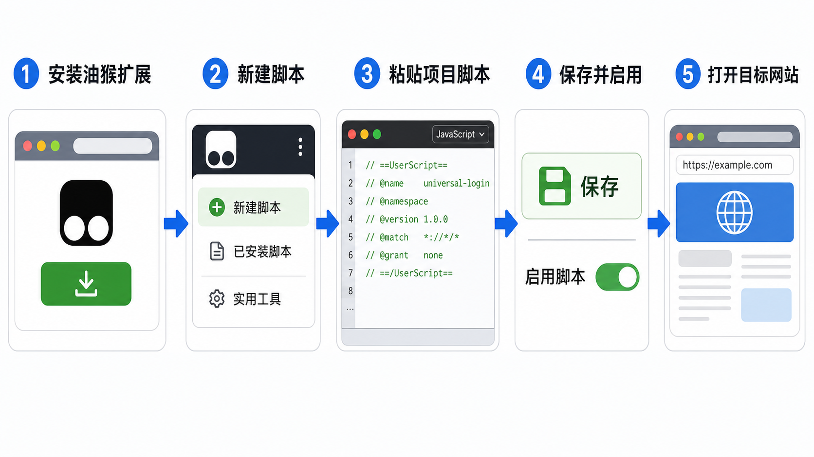
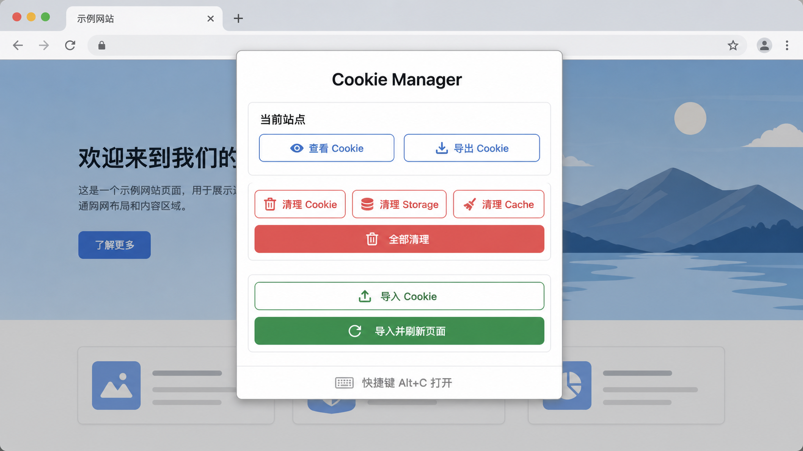

# Universal Login 新手安装与使用指南

这份文档面向第一次使用油猴脚本的用户，按“安装油猴扩展 -> 安装当前项目脚本 -> 打开面板 -> 使用功能”的顺序说明。

> 安全提醒：Cookie 相当于网站的临时登录凭证。不要把 Cookie 发给陌生人，也不要导入来源不明的 Cookie。

## 1. 整体流程

先记住完整路径：浏览器安装油猴扩展，然后把本项目的 `universal-login.user.js` 粘贴到油猴脚本编辑器里，保存并启用，最后在目标网站按 `Alt+C` 打开工具面板。



## 2. 安装油猴扩展

油猴扩展常见名称是 Tampermonkey。Chrome、Edge、Firefox 都可以使用，入口通常在浏览器扩展商店。

1. 打开浏览器扩展商店。
2. 搜索 `Tampermonkey`。
3. 点击安装，并确认添加到浏览器。
4. 安装完成后，浏览器右上角会出现油猴图标；如果看不到，可以在扩展管理里把它固定到工具栏。

如果浏览器提示扩展需要读取网页权限，这是用户脚本管理器的正常权限需求。本项目脚本需要在网页里读取、导出、清理和写入 Cookie，所以必须通过油猴运行。

## 3. 安装当前项目脚本

项目脚本文件是仓库根目录下的 `universal-login.user.js`。

1. 点击浏览器右上角的油猴图标。
2. 进入“管理面板”或“Dashboard”。
3. 点击“新建脚本”或带加号的按钮。
4. 删除编辑器里默认生成的示例代码。
5. 打开本项目的 `universal-login.user.js`，复制全部内容并粘贴到油猴编辑器。
6. 保存脚本，通常快捷键是 `Ctrl+S`，macOS 是 `Command+S`。
7. 回到油猴管理面板，确认脚本处于启用状态。

安装成功后，脚本名称应显示为：

```text
Universal Login - Cookie Manager
```

## 4. 打开 Cookie Manager 面板

进入任意需要管理 Cookie 的网站后，可以用两种方式打开面板：

1. 按快捷键 `Alt+C`。
2. 点击油猴图标，在菜单里选择 `Cookie Manager`。

面板打开后，顶部会显示当前域名和当前 Cookie 读取引擎。底部提示 `快捷键 Alt+C 打开 | ESC 关闭`，按 `ESC` 可以关闭面板。



## 5. 查看和导出 Cookie

打开面板后，`Cookie 列表` 会展示当前网站能读取到的 Cookie。

- `导出 Cookie`：把当前网站 Cookie 复制到剪贴板，适合备份或迁移到另一个浏览器。
- `刷新列表`：重新读取当前页面的 Cookie，适合导入或清理之后确认结果。

注意：部分网站的关键 Cookie 可能是 `HttpOnly` 类型，普通网页脚本无法通过 `document.cookie` 读取。本脚本已经声明 `GM_cookie` 权限，油猴支持时会优先使用 `GM_cookie` 来增强读取和清理能力。

## 6. 清理登录状态和缓存

面板里的清理区提供四个按钮：

- `清除所有 Cookie`：清理当前域名及常见父域名变体下的 Cookie。
- `清除 Storage`：清理 `localStorage` 和 `sessionStorage`。
- `清除 Cache Storage`：清理网站通过 Cache Storage 保存的缓存。
- `一键清除全部`：同时清理 Cookie、Storage 和 Cache Storage。

如果目标是“退出当前网站登录状态”，优先使用 `一键清除全部`，然后刷新页面确认是否已退出。

## 7. 导入 Cookie 快速登录

导入 Cookie 的基本步骤：

1. 打开目标网站，例如需要登录的网站首页。
2. 按 `Alt+C` 打开 `Cookie Manager`。
3. 把 Cookie 字符串粘贴到“导入 Cookie”输入框。
4. 点击 `导入 Cookie`，只写入 Cookie，不刷新页面。
5. 或点击 `导入并刷新页面`，写入成功后自动刷新，更适合快速验证登录状态。

支持的 Cookie 示例：

```text
auth_token=abc123; guest_id=v1:123; ct0=xyz789
```

也支持带属性的格式：

```text
auth_token=abc123; Path=/; Domain=example.com; SameSite=Lax
```

新手建议优先使用 `导入并刷新页面`，因为很多网站只有页面刷新后才会重新识别登录状态。

## 8. 常见问题

### 按 Alt+C 没反应

先检查三个点：

1. 油猴扩展是否启用。
2. `Universal Login - Cookie Manager` 脚本是否启用。
3. 当前页面是否刷新过；脚本安装后，已经打开的旧页面通常需要刷新一次。

### 导入 Cookie 后还是未登录

常见原因有：

1. Cookie 已经过期。
2. Cookie 不属于当前网站域名。
3. 网站还校验 IP、设备指纹、User-Agent 或本地存储。
4. 缺少 `localStorage`、`sessionStorage` 里的登录数据。

处理思路是先确认 Cookie 来源网站和当前网站域名一致，再使用 `导入并刷新页面`。如果仍失败，说明该网站登录态不只依赖 Cookie。

### 清理后网站仍像登录状态

可以再执行一次 `一键清除全部`，然后手动刷新页面。如果仍然存在状态，可能是浏览器缓存、Service Worker 或网站账号状态没有完全更新。

## 9. 小白使用建议

- 只在自己账号、自己设备之间迁移 Cookie。
- 导入前先确认当前网站域名正确，避免把 Cookie 写到错误网站。
- 清理按钮会影响当前网站登录状态，操作前先确认是否需要保留登录。
- 不要在公共电脑上导出、保存或导入 Cookie。

